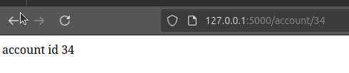
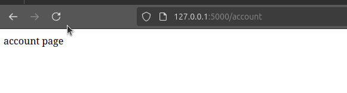

Современные сайты используют URL-адреса для отображения различных страниц, например для того чтоб войти в ваш профиль на платформе
Stepik вы должны перейти по маршруту ```https://stepik.org/users/633006831/profile```

Давайте создадим пару маршрутов на нашем сайте, для этого перейдем в файл app.py

и добавим маршруты

```python
from flask import Flask

app = Flask(__name__)

@app.route("/")
def index():
    return "index page"

@app.route("/about")
def about():
    return "about page"

@app.route("/account")
def account():
    return "account page"

```

И так, мы создали 2 новых маршрута, ```about``` и ```account```, пока-что они выводят просто текст, но в будущем они будут обрабатывать реальные
пользовательские запросы. Заметьте, что в маршруте ```index``` мы ничего не указали, это означает что страница будет индексная, то есть стартовая.

Когда пользователь войдет на сайт, он автоматически попадет именно на этот маршрут.

```python
@app.route("/")
def index():
    return "index page"
```

Теперь давайте снова запустим сервер, командой ```flask --app app run --debug```

Перейдя по маршруту ```/about``` увидим:  

  
Давайте также перейдем по маршруту ```account/```  



Маршруты которые не имеют параметров называются статическими. Например:
```python
@app.route("/about")
```

Но иногда, требуется выводить информацию о конкретном пользователе, например с каким-то числовым идентификатором, например id
для этого мы можем создать части URL-адреса динамически.

# Правила переменных 

Давайте для явного укажем, что наш маршрут принимает id какого-то пользователя.
```python
@app.route("/account/<int:id>")
def account(id):
    return f"account id {id}"
```

Теперь давайте перейдем по маршруту ```account``` и через слеш укажем рандомное число, например 34.
Мы увидим следующее:  
